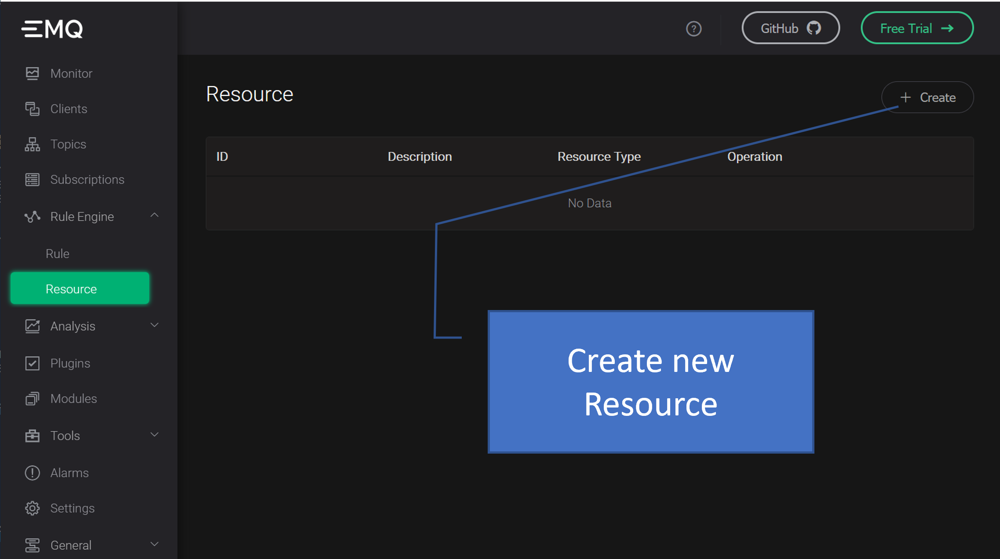
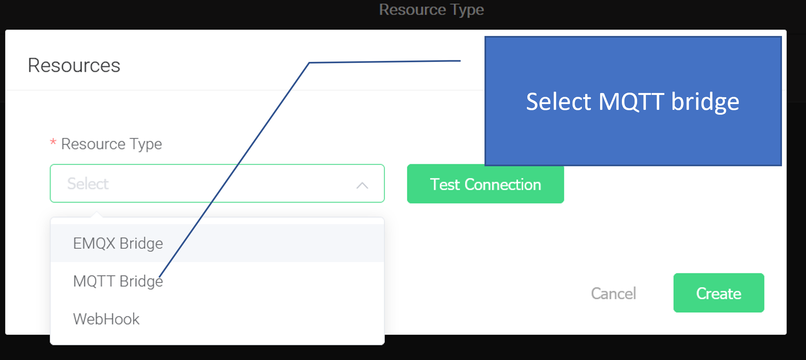
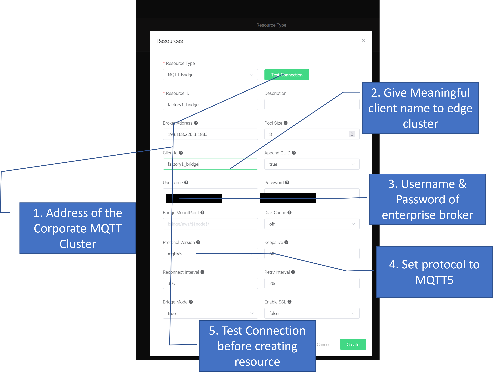
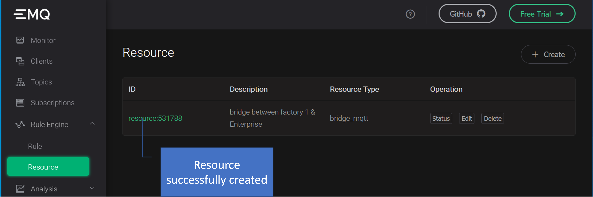
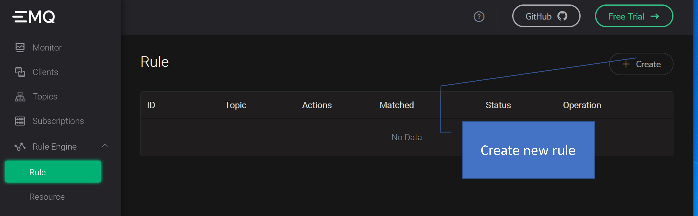
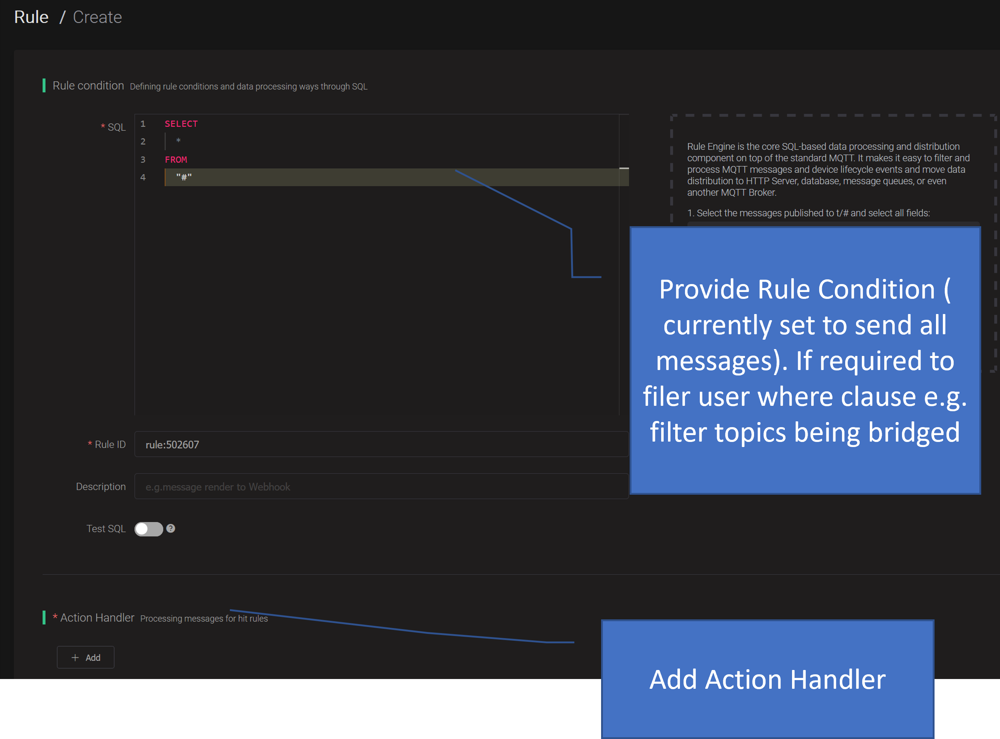
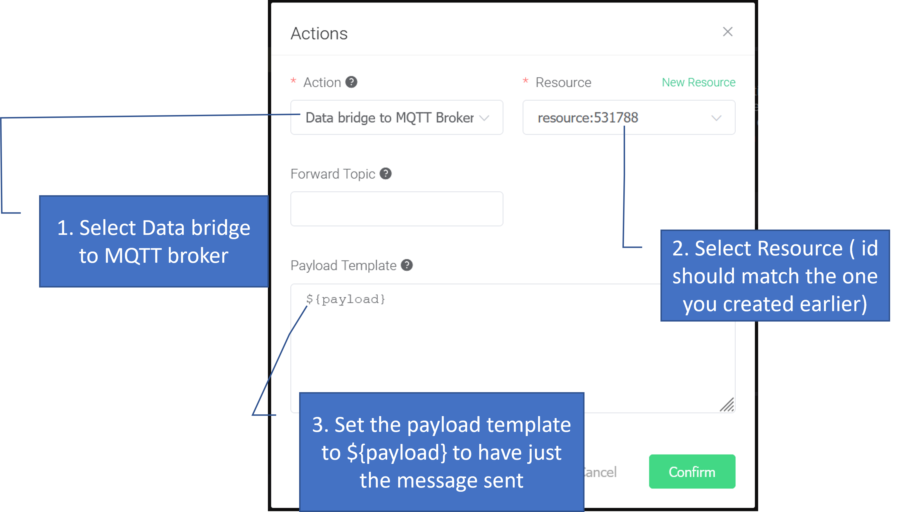
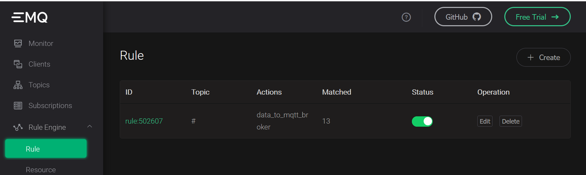

# The MQTT Cluster 
The MQTT Cluster from EMQX is easily setup on a cluster. *There are other ways like within a docker or directly via the executable, but I choose to use the K8s setup to be able to leverage the benefits of scaling up, failover and other orchestration benefits.*
Before proceeding ensure that you have setup your K8s Cluster as described in [01_k8scluster](./../01_k8scluster/Readme.md)

```bash
microk8s helm3 repo add emqx https://repos.emqx.io/charts
microk8s helm3 repo update
microk8s helm3 search repo emqx

# This command needs to be executed to have persistence available to the MQTT instances
# Select the storage class available to your cluster openebs-hostpath, openebs-jiva-csi-default etc.
kubectl patch storageclass openebs-hostpath -p '{"metadata": {"annotations":{"storageclass.kubernetes.io/is-default-class":"true"}}}'
```
> **Important Note:** Validate that you have the correct persistance storage class
> By default when you install the openebs module for microk8s, you should get  "openebs-hostpath"
> ```bash
> # command to view the available strorage classes.
> kubectl get sc
> ```
## MQTT Cluster for the edge
Using `helm` install the MQTT Cluster on the edge. I choose to have each cluster in it's own namespace
```bash
# Install the Edge version of EMQX which has a smaller footprint and developed specifically for the edge
#microk8s helm3 install uns-emqx-edge emqx/emqx  --namespace <FACTORY NAME>   --set image.repository=emqx/emqx-edge --set service.type=LoadBalancer --create-namespace --wait
#e.g. 

microk8s helm3 install uns-emqx-edge emqx/emqx  --namespace factory1   --set image.repository=emqx/emqx-edge --set service.type=LoadBalancer --create-namespace --wait
```

```bash
# Upgrade installtion with newer version #e.g. 
microk8s helm3 repo update
microk8s helm3 upgrade --install uns-emqx-edge emqx/emqx  --namespace factory1   --set image.repository=emqx/emqx-edge --set service.type=LoadBalancer --create-namespace --wait
```

## MQTT Cluster for the enterprise / cloud 
Normally you would could to use the cloud service MQTT server. I choose to install a K8s cluster for the enterprise cluster of EMQX 

```bash
# Install the central cluster  EMQX brokers at  the Corporate instance/ Cloud
microk8s helm3 install uns-emqx-corp emqx/emqx  \
            --namespace enterprise \
            --set persistence.enabled=true \
            --set persistence.size=100M \
            --set persistence.storageClass=openebs-hostpath \
            --set service.type=LoadBalancer \
            --create-namespace \
            --wait
```

## Configure MQTT bridge between Edge Cluster and Enterprise
The guide for setting up the MQTT bride via the dashboard is provided [here]
(https://www.emqx.io/docs/en/latest/rule/bridge_emqx.html)
A simplified guide is given here
#### Step 1: Log in to the EMQX Dashboard of your edge cluster
#### Step 2: Create Resource 

#### Step 3: Create MQTT Bridge 

#### Step 4: Give details of the Enterprise Broker Cluster

#### Step 5: Confirm Resource creation 

#### Step 6: Create Rule for MQTT bridging  


The SQL condition to use is 
```sql
SELECT * from '#'
```
#### Step 7: Add Action Handler

> By using the payload template as ${payload} we ensure that the exact same message with no additional attributes is sent over the bridge otherwise EMQX adds a bunch of additional attributes and pushes the entire message to the attriute ´payload´.
#### Step 5: Confirm Rule creation & activation


## Secure your EMQX cluster
Since we have deployed on K8s, concepts like SSL/TLS should ideally be handled at the [Ingress Controller](https://kubernetes.github.io/ingress-nginx/examples/tls-termination/)

For further securing options, like ACL, additional authentication methods etc. EMQX has provide quite some [documentation, guides](https://www.emqx.com/en/blog/category/security) for securing the cluster. 

> **Important Note**: The installation exposes the dashboard with the [standard user & credentials](https://www.emqx.io/docs/en/v4.4/getting-started/dashboard.html#view-dashboard). Remember to update the default user as well as the password after the system is deployed

## Known Limitations / workarounds
1. MQTTv3.1 appears not to be supported by EMQX. While testing client code using `paho.mqtt.client` against [broker.emqx.io](https://www.emqx.com/en/mqtt/public-mqtt5-broker) observed that the connection was not happening and neither the `on_connect()` nor the `on_connect_fail()` callbacks were invoked. Since most clients would be either MQTTv3.1.1 or MQTTv5.0 this should not be a problem. In local testing and implmentations I have chosen to go with MQTT 5

1. The plugins to intercept messages from EMQx ( which is probably the more efficient mechanism) in order to persist them are available only in the enterprise version and not in the community edition. As a workaround, I created an MQTT client which subscribes to `#` and allows subsequent processing.

1. Currently the configuration of the MQTT bridge is a manual step via the EMQX dashboard. Need to automate this via code

1. Need to study and understand which storage class is better suited for this use-case of UNS