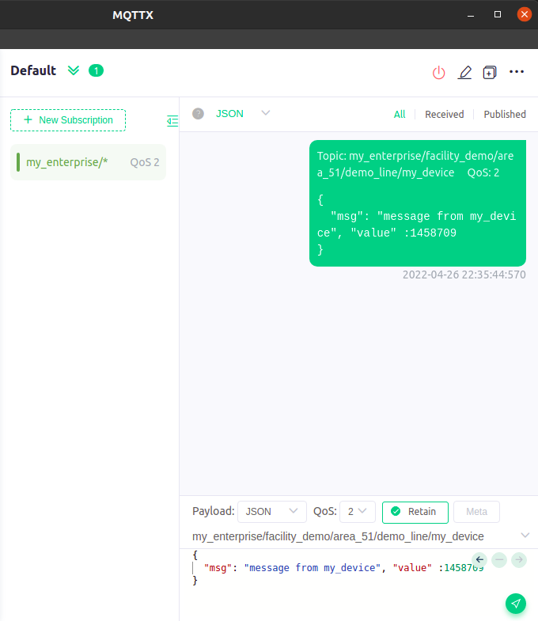
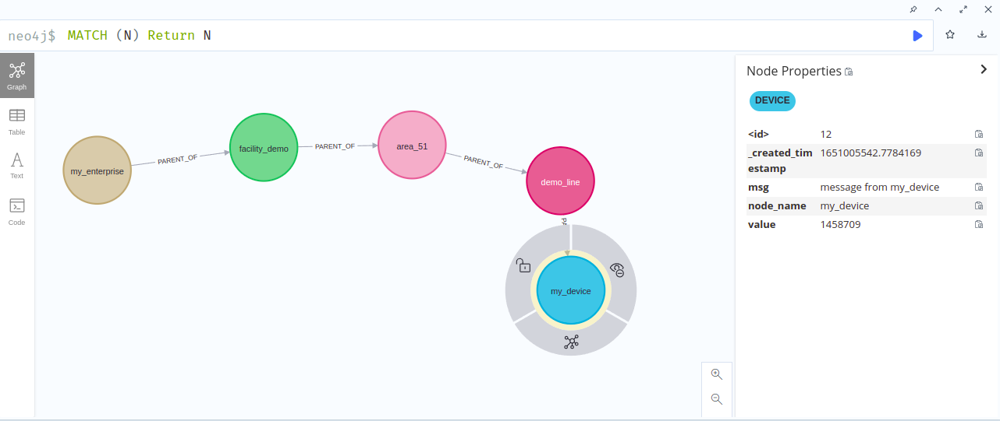
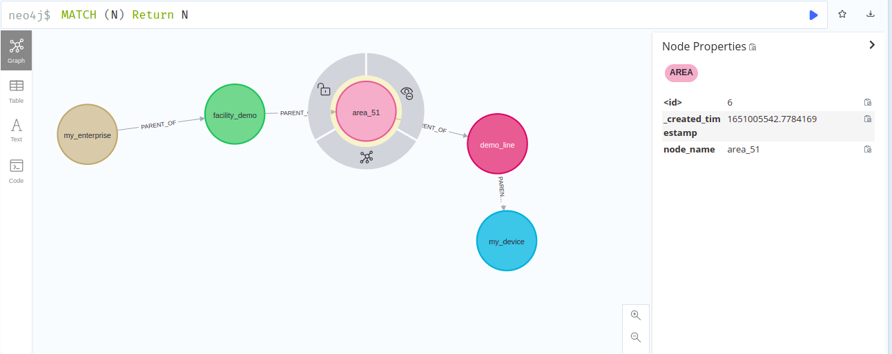
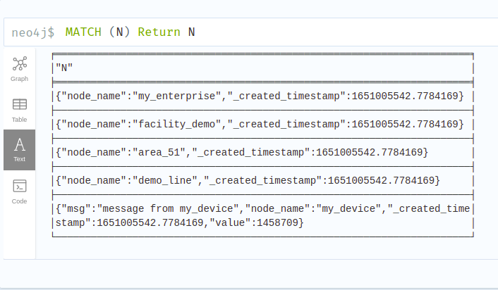
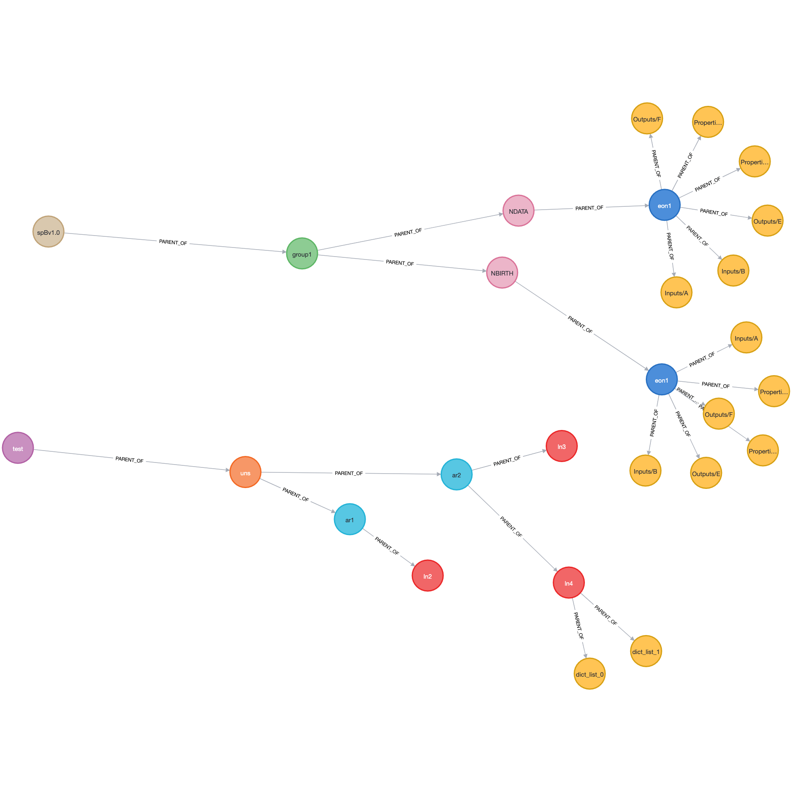

[](https://github.com/mkashwin/unifiednamespace/actions/workflows/uns_graphdb-app.yml)

# Application to store messages to graphDB 

We will be publishing messages as per the ISA-95 part 2 specifications
> \<enterprise\>/\<facility\>/\<area\>/\<line\>\<device\>

We choose a graph database in this case because it allows us to define and maintain relationships and connections across our enterprise as well as merge messages to the same topic.
e.g. the ERP system which is publishing to the Enterprise node can have a relationship with a device allowing us to easily correlate identifiers across the various systems.

The GraphDB is not a store for historical data, this decision is done for performance purposes and the ability to define relationships easily across the entities. For the historian capability refer to the [historian](./../04_uns_historian/Readme.md) module.

The GraphDB is also deployed both at the factory level and enterprise level. 
Devices can query the GraphDB if they need merged data. If they just need the latest message published it would be more efficient to subscribe to the topic ( assuming that MQTT messages are published with retain flag as true).

We need setup 2 instances of this connector
1. ***(Mandatory)*** Setup the application to point to the enterprise instance / cloud instance . This instance will be used by the to link data across all factories and enterprise application. It is important to have the connector listen to Topic '**#**' or the first level '**\<enterprise\>/#**'  while connecting to the enterprise/cloud  MQTT cluster instance.
1. ***(Optional)*** Setup the application to point to the factory instance. This instance will be used by the application to provide a snapshot of the merged data to the factory devices. For the factory cluster it would make sense to listen to the lower topic i.e. `+/+/+/#` or `+/+/#` 

## Deploying and running Neo4j
There are a number of ways to deploy and run your Neo4j instance. 
I chose to run this as a docker instance to ease the setup and portability. 

**[Detail Guide](https://neo4j.com/developer/docker-run-neo4j/)**$
We will also be using the [APOC plugin](https://neo4j.com/docs/apoc/5/).

Quick command reference 
```bash
# install docker
sudo snap install docker
# add current user to docker group so that we don't need to sudo for docker executions 
sudo groupadd docker
sudo usermod -aG docker $USER
# you might need to reboot here  
# Run the database docker
docker run \
    --name  uns_graphdb \
    -p7474:7474 -p7687:7687 \
    --user="$(id -u):$(id -g)" \
    -d \
    -v $HOME/neo4j/data:/data \
    -v $HOME/neo4j/logs:/logs \
    -v $HOME/neo4j/plugins:/plugins \
    -v $HOME/neo4j/import:/var/lib/neo4j/import \
    --env NEO4J_AUTH=neo4j/uns_neo4j_password \
    --env apoc.export.file.enabled=true \
    --env apoc.import.file.enabled=true \
    --env apoc.import.file.use_neo4j_config=true \
    --env NEO4J_PLUGINS=\[\"apoc\"\] \
    neo4j:latest
# --name : <container_name> . Needed 
# -p : # Ports of operation 7687 is the DB server, 7474 is the Neo4j browser( not recommended for production)
# -v : volume to persist data,logs, import file directory and plugins
#- d : run the container detached
# --env NEO4J_AUTH=#<username/<password> 
```
In a production environment we should download the APOC release matching our Neo4j version and, copy it to a local folder, and supply it as a data volume mounted at /plugins. See [APOC Installation Guide](https://neo4j.com/docs/apoc/5/installation/#docker)

**The key parameters you must update for your environment are :**
* \<container_name\> : is a name you give to identify your container
* \<username\> : is the username needed to connect to the DB. Needs to be updated in [./.secrets.yaml](#key-configurations-to-provide)
* \<password\> : is the password needed to connect to the DB. Needs to be updated in [./.secrets.yaml](#key-configurations-to-provide) 

Depending on your context you may need to change the other properties like port, directories etc. 
Once the docker container is deployed you can work on 
```bash
docker start  uns_graphdb #<container_name>
docker stop  uns_graphdb #<container_name>
```

## Key Configurations to provide
This application has two configuration file 
1. [settings.yaml](./conf/settings.yaml):  Contain the key configurations need to connect with MQTT brokers as well as Neo4j db.
    **key** | **sub key** | **description**  | ***default value*** |
    ------ | ------ | ------ | ------
    **mqtt** | **host**\*| Hostname of the mqtt broker instant. Mandatory configuration | *None*
    mqtt | port | Port of the mqtt broker (int) | *1883*
    mqtt | topics | Array of topics to be subscribed to. Recommend subscribing to a level +/#  and spBv1.0 e.g. ["erp/#","spBv1.0/#"] | *["#"]* 
    mqtt | qos | QOS for the subscription. Valid values are 0,1,2 | *1*
    mqtt | keep_alive | Maximum time interval in seconds between two control packet published by the client (int) | *60*
    mqtt | reconnect_on_failure | Makes the client handle reconnection(s). Recommend keeping this True  (True,False)| *True*
    mqtt | version | The MQTT version to be used for connecting to the broker. Valid values are : 5 (for MQTTv5), 4 (for MQTTv311) , 3(for MQTTv31) | *5*
    mqtt | transp ort | Valid values are "websockets", "tcp" | *"tcp"*
    mqtt | ignored_attributes | Map of topic &  list of attributes which are to be ignored from persistance. supports wild cards for topics  and nested via . notation for the attributes <br /> e.g.<br />  {<br /> 'topic1' : ["attr1", "attr2", "attr2.subAttr1" ],<br /> 'topic2/+' : ["A", "A.B.C"],<br /> 'topic3/#' : ["x", "Y"]<br /> } |  *None* 
    mqtt | timestamp_attribute | the attribute name which should contain the timestamp of the message's publishing| *"timestamp"*
    **graphdb** | **url**\* | Mandatory. The db connection URL string for your Neo4j instance| *None*
    graphdb | database | the data base name to write to. if not provided default db ('') will be used | *''*
    graphdb | uns_node_types | List based on ISA-95 part 2 the nested depth. Nodes will by tagged with the node type depending on their depth. Can be of variable length. Recommended is 5 | ["ENTERPRISE", "FACILITY", "AREA", "LINE", "DEVICE"] 
    graphdb | spB_node_types | List based SparkplugB namespace specifications. Nodes will by tagged with the node type depending on their depth. This must be of length 5 | ["spBv1_0", "GROUP", "MESSAGE_TYPE", "EDGE_NODE", "DEVICE"]     
    **dynaconf_merge**\*  |  | Mandatory param. Always keep value as true  |
    
1. [.secret.yaml](./conf/.secrets_template.yaml) : Contains the credentials to connect to the MQTT cluster and the GraphDB. This file is not checked into the repository for security purposes. However there is a template file provided **`.secrets_template.yaml`** which should be edited and renamed to **`.secrets.yaml`**.

    **key** | **sub key** | **sub key** | **description**  | ***default value*** |
    :------ | :------ | :------ | :------ | :------
   mqtt | username | | The user id needed to authenticate with the MQTT broker | *None*
   mqtt | password | | The password needed to authenticate with the MQTT broker | *None*
   mqtt | tls | |Provide a map of attributes needed for a TLS connection to the MQTT broker. See below attributes | *None*
   mqtt | tls | ca_certs | fully qualified path to the ca cert file. Mandatory for an SSL connection | *None* 
   mqtt | tls | certfile | fully qualified path to the cert file | *None*
   mqtt | tls | keyfile | fully qualified path to the keyfile for the cert| *None*
   mqtt | tls | cert_reqs | Boolean. If note provided then  ssl.CERT_NONE is used. if True the ssl.CERT_REQUIRED is used. else ssl.CERT_OPTIONAL is used | *None*
   mqtt | tls | ciphers | Specify which encryption ciphers are allowed for this connection | *None*
   mqtt | tls | keyfile_password | Password used to encrypt your certfile and keyfile | *None*
   mqtt | tls | insecure_cert | Boolean. Skips hostname checking required for self signed certificates.  | *True*
   **graphdb** | **username**\* | | The user id  needed to authenticate with GraphDB | *None*
   **graphdb** | **password**\* | | The password needed to authenticate with GraphDB | *None*
   **dynaconf_merge**\*  |  | | Mandatory param. Always keep value as true  |

## Running the python script
This function is executed by the following command with the current folder as `03_uns_graphdb`
```bash
# install virtual env
python -m pip install --user virtualenv
python -m venv env_graphdb
source env_graphdb/bin/activate
python -m pip install --upgrade pip
python -m pip install  -r requirements.txt
pip install --upgrade -e .
pip install --upgrade -e ../02_mqtt-cluster
python ./src/uns_graphdb/graphdb_handler.py
```

### Running tests
The set of test for this module is executed by
```python
source env_graphdb/bin/activate
python -m pip install  -r requirements_dev.txt
#run all tests excluding integration tests 
pytest -m "not integrationtest" test/
# runs all tests
pytest test/
```

## Logic for persisting MQTT messages to the Graph DB
The GraphDB will always store the latest value of all attributes but allows merging of MQTT messages also.

**It is important to model the the data structure correctly specially to ensure that different messages on the same topic are correctly merged.**

All messages which are published to the same topic name will be merged to the same node. If two messages publish the same attribute in their message the the newer message attribute will override the existing value
 
The node type will be determined the topic depth on which it is publish

**MQTT Topic** | **Node Type**
------ | ------
\+ | enterprise
\+/\+ | facility
\+/\+/\+ | area
\+/\+/\+/\+ | line
\+/\+/\+/\+/\+ | device


e.g. Any message published to the topic `erp/` will be saved as node of type Enterprise. 
The topic name "*erp*" will be the identifier so if multiple messages are published to the same topic all those attributes will be merged. 

Topic : **erp/** 

*message 1:* 
```json 
    {value1: 202203011130, id1: "identifier"} 
```
*message 2:* 
```json 
    {value1: 202203011145, sensor1: 100} 
```

will result in a node in the GraphDB
```json
(erp:enterprise : { id1: "identifier", sensor1: 100, value1: 202203011145})
```
### Examples of MQTT Message being persisted to the GraphDB
- By publishing the following message to the MQTT  Broker    <br/>
  
- We get the following graph created <br/>
   
- Each level of the topic is represented as a node with a relationship also established between the nodes.
  The label to the nodes is also assigned as per the Node Types which were [configured](#key-configurations-to-provide).

  e.g. the node `my_device` in this message  has the label `DEVICE` in the GraphDB.

  e.g. the node `area51` in this message  has the label `AREA` in the GraphDB. <br/>
   
- A Tabular of the same data <br/>
   

- Graph view of UNS and Sparkplug payloads <br/>
   

## Limitations / workarounds 
* [x] ~~Handle nested JSON messages.~~ 
  Neo4j does not support nested attributes. so for nested attributes we create a child node for type dict
  Current handling logic could be improved disparate lists of dict and primitives but works with consistent lists of dicts
  See the function [graphdb_handler.py#separate_plain_composite_attributes()](./src/uns_graphdb/graphdb_handler.py#separate_plain_composite_attributes) and [graphdb_handler.py#save_attribute_nodes](./src/uns_graphdb/graphdb_handler.py#save_attribute_nodes)
  ~~If your message contains nested data the current logic will flatten the JSON object. See the function [graphdb_handler.py#flatten_json_for_neo4j()](./src/uns_graphdb/graphdb_handler.py#flatten_json_for_neo4j)~~
* [x] ~~Handling exceptional case of mqtt message containing the key ***"node_name"***.~~
  If your MQTT message contains the key ***"node_name"***, The key will be changed to uppercase before storing. This is because our application uses the key ***"node_name"*** to uniquely identify the node. This is the stripped topic name. 
* [ ] Need to check how to containerize and perhaps deploy this on the same cluster as the MQTT  brokers
* [x] Add and improve automated test coverage
* [ ] Enhancing ACLs on the nodes for the various nodes to secure access
* [ ] Securing the Neo4j database 