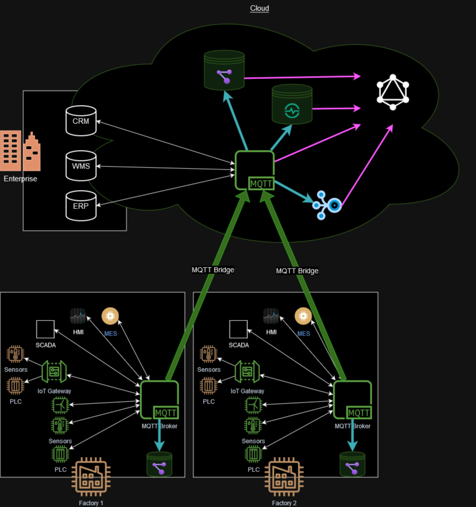

# Unified Name Space (UNS)

[](https://github.com/mkashwin/unifiednamespace/actions/workflows/python-app.yml)
[](https://github.com/astral-sh/ruff)

This project aims to create an open sourced option for setting up a Unified Namespace for IIOT transformation.

My objective is to build an open source, free to use UNS solution for the community which can be enhanced and adapted by other enthusiasts.

All components used in this solution are community versions and I do not own any rights on them. Most of them also provide a commercial / enterprise version which may also be considered to have better tool support.
I also used this, as an opportunity to learn Python.

If you are looking for an alternative Unified Namespace implementation with enterprise support, check out the [United Manufacturing Hub](https://learn.umh.app/), which is an Open-Source Helm Chart for Kubernetes.

## What is the Unified Name Space?

A Unified Namespace is an **_architecture_** that establishes a ***centralized repository*** of data, events,  information, and context **_across all IT and OT systems_** where any application or device can consume or publish data needed for a specific action via an **_event-driven_** and **_loosely coupled architecture_** ​along with the **_relevant context and history_**

This is a critical concept to allow scalability by preventing point to point connectivity.


### **References / Further Reading**

1. [Video explaining UNS](https://youtu.be/PB_9HIgSCWc)
1. [UNS Q&A by Walter Reynolds](https://youtu.be/IiUZTSGjCQI)
1. [Event driven architecture on Wikipedia](https://en.wikipedia.org/wiki/Event-driven_architecture)​
1. [Advantages of Event Driven Architecture](https://developer.ibm.com/articles/advantages-of-an-event-driven-architecture/)
1. [Unified Namespace as extended event-driven architecture](https://learn.umh.app/know/industrial-internet-of-things/techniques/unified-namespace/)

---

## **Architecture**

The overall architecture and the deployment setup is as follows

1. Factory1
   - K8s Cluster on the edge
   - MQTT edge installed on K8s
   - Bridge between Factory1 and the Enterprise MQTT clusters
   - Graph DB installed and running on docker
   - UNS graphdb client to persist messages to the Graph DB instance
   - UNS SparkplugB client to translate message from SparkPlug to UNS

1. Factory2
   - K8s Cluster on the edge
   - MQTT edge installed on K8s
   - Bridge between Factory2 and the Enterprise MQTT clusters
   - Graph DB installed and running on docker
   - UNS graphdb client to persist messages to the Graph DB instance
   - UNS SparkplugB client to translate message from SparkPlug to UNS

1. Enterprise on Cloud
   - K8s Cluster of the enterprise
   - MQTT Broker installed on K8s
   - TimescaleDB installed and running on docker / cluster / K8s / hosted service
   - Graph DB installed and running on docker / cluster / K8s / hosted service
   - Kafka cluster/ K8s / hosted service
   - GraphQL service running and connected to the cloud data stores
   - UNS graphdb client to persist messages to the Graph DB instance
   - UNS historian client to persist messages to the Graph DB instance
   - UNS Kafka listener to stream/convert MQTT messages to the Kafka instance



---

## **Technology Choices**

The following section lists the various options and technology choices that I evaluated and the reasoning for choosing them.
This should hopefully also give you possible alternatives to consider if you choose to implement and extend this for your needs.
The opinions below are my personal ones with no influence from the companies that built them

### **Clustering at the Edge with Kubernetes**

To run the MQTT broker on the Edge, a cluster is **_not_** a prerequisite. If you do not have a business need for a high availability MQTT cluster, running just a single instance ( probably within a docker) would be a lot more easier.

Even for a clustered setup most of the MQTT brokers do provide an option for clustering however running this cluster on K8s provides significant benefits for scaling, auto healing etc.

I evaluated the following K8s options because it needs to be a extremely light weight and high performant distribution to be able to run on the edge (constrained environments). Any of these is a perfectly good choice depending on your context.

1. [MicroK8s](https://microk8s.io/)
1. [K3s](https://k3s.io/)

There are quite some comparisons between the the k8s distributions on the net so I am not going to list detailed comparison here.

I finally choose to go ahead with **_MicroK8s_** because

- Most of my environment was on Ubuntu hence enabling a snap for microk8s was very easy
- The inbuilt addons and the ease of enabling them without wading through YAML files
- The default CNI provided for the cluster is Calico which [claimed](https://www.suse.com/c/rancher_blog/comparing-kubernetes-cni-providers-flannel-calico-canal-and-weave/) to be more performant
- Setting up a High Availability cluster is extremely easy by adding multiple master nodes

  > **Note:** Avoid setting up high availability and multiple masters for your edge cluster as this increases the resource consumption & load on the edge devices. A single master node should suffice majority of your availability requirements if you actually even need a k8s cluster on the edge in the first place.

- Having a bit more experience with Ubuntu I found the documentation and guides a lot more easy to find and follow, including the community support, especially troubleshooting.

However microk8s did show up some limitations as well as bugs. Details of these are in **[01_k8scluster](./01_k8scluster/README.md)**. The link will provide details of all the addons, workarounds etc. that I did for bringing up my cluster. If you choose to setup your k8s with a different distribution, each of those addons could be setup / configured albeit in a different manner.

Some key limitations to bear in mind

- I faced some stability issues while trying to run this lower raspberry pi (pi3)
- microk8s is not available for every linux distribution.

---

### **MQTT Broker**

The backbone of the **_Unified Name Space_** is the MQTT broker.

#### **Why MQTT**

The overall structure of the UNS is based on the hierarchical structure as defined in ISA-95 part 2.

> \<enterprise\>/\<facility\>/\<area\>/\<line\>/\<device\>

The level at which the message is published has a direct implication on it's time sensitivity as well as guidance on being processed at the edge or on the cloud.  


I evaluated and read the user guides of the following brokers (open source versions only). All three also provide commercial / enterprise versions which is recommended for more robust setup and professional support

1. [EMQX](https://www.emqx.io/)
2. [VERNEMQ](https://vernemq.com/)
3. [HIVEMQ](https://www.hivemq.com)

While HIVEMQ has the best documentation and community support I decided try out EMQX for the following reasons

- EMQX is written in erlang which has a lower footprint than java (HIVEMQ).
- They also provide 2 versions of the broker, one specifically lightweight for edge deployment and the standard for enterprise or cloud deployment.

The details of setting up the MQTT cluster are provided in **[02_mqtt-cluster](./02_mqtt-cluster/README.md)**. The link provides the guidance to install EMQX on a K8s cluster using helm.

**_Having said that, any of the above three would be perfectly good selections because_**

- All the three have extension capabilities via standard as well as custom plugins. However I liked the rules plugin from EMQX which comes by default allowing for lot of flexibility for pre and post processing messages. Also EMQX seems to be supporting the ability to create plugins in multiple languages

- All three deploy very easily on K8s and all three have community (free) as well as commercial offering
- All three support **MQTT 5** which is critical for manufacturers. e.g. The concept of [Shared Subscriptions](https://www.hivemq.com/blog/mqtt5-essentials-part7-shared-subscriptions/) enables clustering of the subscribers in order to better scale message processing if needed)
- All three support **Sparkplug B**
- All three support MQTT bridging allowing copying data between edge to cloud instances
- Both [HiveMQ](hivemq.com/mqtt-cloud-broker/) and [EMQX](https://www.emqx.com/en/cloud) provide fully managed cloud services which might be interesting offer to explore for your cloud / enterprise MQTT Cluster

#### Broker Plugins

> **Important Note:** The community edition of these brokers do not provide all functionalities. e.g. EMQX community doesn't allow plugins to be triggered on message delivery (this is an enterprise feature). As I wanted this solution to be completely open source and free, I decided to write an MQTT client subscribing to `"#"`. This works but is less efficient than creating a plugin within the broker and natively persisting the messages to a database. You can further optimize this by subscribing to a subset e.g. `"<enterprise>/#"`
> However if you go for the enterprise version, I would recommend creating a plugin instead of the [MQTT Listeners](#plugin--mqtt-client-to-subscribe-and-write-to-the-above-databases) provided here for better performance. But for most scenarios, an MQTT client should suffice and be broker independent.

Hence I decided to write [my own plugin](#plugin--mqtt-client-to-subscribe-and-write-to-the-above-databases) as an MQTT client which listens to the broker and on message persists the message ( either the GraphDB or the Historian)

### **GraphDB**

Normally I configured the MQTT publishers to publish messages with retain flag so that consumers are able to get the latest message even if they weren't connected with broker at the time of publishing.

However I realized that, in order to merge messages, or provide the capability to add relationships across multiple messages, MQTT alone will not be able to support that. Hence after some deliberation decided to use a Graph Database.

This provide the flexibility of defining relationships , simple way representing your object hierarchy as well as support merging of attributes

I choose to go with **[Neo4J](https://neo4j.com/)** simply because it was the only graphDB I was aware of as well as the fact that it runs seamlessly on Kubernetes.
The GraphDB also allows for extremely fine grained access control across the nodes, specific sections of the tree as well as limit access to specific properties. Refer [Neo4j - Access Control](https://neo4j.com/docs/operations-manual/current/authentication-authorization/access-control/)

> **Important Note:** The clustering feature of neo4j on K8s is an enterprise feature and [not available in the community version](https://community.neo4j.com/t/neo4j-community-edition-on-kubernetes/4955)

### **Historian**

The other critical component of the **_Unified Name Space_** is the historian. This allows to keep a full history of all messages, entities and artifacts generated.
Since the graph databases are not suited for historian data (there were a couple of projects enhancing Neo4j but all were archived), it makes sense to delegate that to specialist.

I evaluated and read the user guides of the following historians

1. [InfluxDb](https://www.influxdata.com/) combined with Telegraf
1. [TimescaleDB](https://www.timescale.com/) combined with [MQTT Listeners](#plugin--mqtt-client-to-subscribe-and-write-to-the-above-databases)

Both of these are excellent options and have significant user adoption. InfluxDb combined with Telegraph provide a strong low code approach to the integration. Telegraf however did not have a plugin for Neo4j and InfluxDb does not support K8s. Given the stronger stability of postgres (on which TimescaleDB is built) as well as support for [JSON](https://docs.timescale.com/timescaledb/latest/how-to-guides/schema-management/json/) I decided to go ahead with **[TimescaleDB](https://www.timescale.com/)**

For production systems you might want to consider the cloud versions of the historians ([InfluxDB Cloud](https://www.influxdata.com/products/influxdb-cloud/) or [TimescaleDB](https://www.timescale.com/products#timescale-cloud)) for lower maintenance and higher scalability

### **Plugin / MQTT Client to subscribe and write to the above databases**

Since I did not have the enterprise version of the MQTT brokers, I decided to develop a broker agnostic solution. Hence the MQTT client seems to be a the best option ( even if it may not be as performant as the Broker plugin/module).

- The MQTT listener to persist UNS messages & SPB messages to the GraphDB can be found at [03_uns_graphdb](./03_uns_graphdb/README.md)
- The MQTT listener to persist UNS messages & SPB messages to the Historian can be found at [04_uns_historian](./04_uns_historian/README.md)
- The MQTT listener to read SPB messages, translate and transform them to the UNS can be found at [05_sparkplugb](./05_sparkplugb/README.md)
- The MQTT listener to publish UNS messages, to a kafka topic [06_uns_kafka](./06_uns_kafka/README.md)
- A module which connects with all the data sources; Neo4j, TimescaleDB, Kafka and MQTT to provide GraphQL apis to query the UNS [07_uns_graphql](./07_uns_graphql/README.md)
- A simulator for test purposes [99_simulator](./99_simulator/README.md)

I choose to write the client in Python even thought Python is not as performant as Go, C or Rust primarily because

- In the OT space most professionals ( in my experience) were more familiar coding with Python than Go, C or Rust. Hence I hope this increases the adoptions and contributions from the community in further developing this tool
- Should a team want to further optimize the code, given the readability and the inline comments in the code, they are hopefully able to rewrite the application in their choice of language

### **Plugin / MQTT Client to translate SparkplugB messages to UNS Namespace**

Sparkplug B consist of three primary features in its definition.

1. The first is the MQTT topic namespace definition.
1. The second is the definition of the order and flow of MQTT messages to and from various MQTT clients in the system.
1. The final is the payload data format.
   As the messages are published in the Sparkplug Namespace , they are not visible in the UNS hierarchy which is based on ISA-95 part 2. Also given that they are packaged in protocol buffers, these message payloads are not easily understandable and need some parsing / transformation to a JSON structure.
   This plugin listens on the SparkplugB topic hierarchy and translate the protocol buffer messages into appropriate UNS messages
   The detailed description of the plugin can be found at [05_sparkplugb](./05_sparkplugb/README.md)

### **GraphQL Support**

GraphQL is a query language for APIs and a runtime for executing those queries with your existing data. It allows clients to request only the data they need and nothing more, enabling precise and efficient data fetching.
Some key benefits of adding this support to the UNS are:

1. **Simplified Data Access**: A Unified Namespace typically brings together diverse data sources or systems into a single cohesive structure. By integrating GraphQL capabilities, it provides a unified and simplified way to access and query this diverse dataset. GraphQL's flexible querying allows for precise data retrieval, avoiding the need to interact with each individual data source separately.
1. **Consolidated Querying**: With GraphQL, querying data from different sources becomes seamless. It allows for composing complex queries across multiple data sources within the Unified Namespace, retrieving precisely the required data without unnecessary overhead or complexity.
1. **Service/Node Discovery**:Given the contextual and hierarchical nature of the UNS, the ability to search for specific Nodes and/or Properties will significantly simplify data discovery and facilitate easier consumption by providing a coherent interface to access the combined data in the Unified Namespace
1. **Dynamic Data Retrieval**: GraphQL's nature allows for dynamic data retrieval, enabling clients to specify the exact fields, relationships, and data they need. This flexibility aligns well with the diverse nature of data sources within a Unified Namespace, allowing clients to fetch the required information efficiently.

## **Setting up the development environment**

The current project contains the following microservices

1. [01_k8scluster](./01_k8scluster/README.md): Scripts and utilities to create a K8s cluster (on the edge and in the cloud)
1. [02_mqtt-cluster](./02_mqtt-cluster/README.md): Scripts and utilities to create a MQTT cluster (on the edge and in the cloud). Common python package for all uns mqtt listeners and sparkplugB generated code and helper code
1. [03_uns_graphdb](./03_uns_graphdb/README.md): Python project for mqtt listener that persists all message of the UNS and SparkplugB namespaces to a GraphDB. Spb messages are translated from protocol buffers to JSON prior to persisting
1. [04_uns_historian](./04_uns_historian/README.md): Python project for mqtt listener that persists all message of the UNS and SparkplugB namespaces to a Historian. Spb messages are translated from protocol buffers to JSON prior to persisting
1. [05_sparkplugb](./05_sparkplugb/README.md): Python project for mqtt listener that listens to the SparkplugB namespace and for translates relevant messages to publish to the UNS namespace
1. [06_uns_kafka](./06_uns_kafka/README.md): Python project for mqtt listener that subscribes to the MQTT broker and publishes to the KAFKA broker
1. [07_uns_graphql](./07_uns_graphql/README.md): Python project for GraphQL server to query the Unified NameSpace
1. [99_simulator](./99_simulator/README.md): Python project for simulating data creation to the UNS. _*NOT TO BE USED IN PRODUCTION*_

Each microservice can be independently imported into VSCode by going into the specific microservice folder. Instructions on setting up the python pip & virtual environments are provided in the respective ´README.md´ within that folder
However to import all microservices into the same workspace, the following commands need to be executed in the terminal of your VSCode and the current folder as [`.`](/.) (parent to all the microservices)

This has been tested on **Unix(bash)**, **Windows(powershell)** and **Mac(zsh)**

```bash
python -m pip install --upgrade pip uv
uv venv
uv sync
```

While importing the folder into VSCode remember to do the following steps the first time

> 1. Open a terminal in VSCode
> 1. Activate the virtual env
>
>    ```bash
>    python -m pip install --upgrade pip uv
>    uv venv
>    uv sync
>    ```
>
> 1. Select the correct python interpreter in VSCode (should automatically detect the .venv virtual environment)

### Running tests

```python
# run all tests
uv run pytest
```

```python
# run all tests excluding integration tests
uv run pytest -m "not integrationtest"
```

```python
# run all tests for a specific module
uv run pytest  ./02_mqtt-cluster
uv run pytest  ./03_uns_graphdb
uv run pytest  ./04_uns_historian
uv run pytest  ./05_sparkplugb
uv run pytest  ./06_uns_kafka
uv run pytest  ./07_uns_graphql
uv run pytest  ./99_simulator
```

```python
# run all tests for a specific module excluding integration test
uv run pytest -m "not integrationtest" ./02_mqtt-cluster
uv run pytest -m "not integrationtest" ./03_uns_graphdb
uv run pytest -m "not integrationtest" ./04_uns_historian
uv run pytest -m "not integrationtest" ./05_sparkplugb
uv run pytest -m "not integrationtest" ./06_uns_kafka
uv run pytest -m "not integrationtest" ./07_uns_graphql
# 99_simulator has no integration tests hence the normal call will suffice
```

## Known Limitations / workarounds

1. **Windows**: Allowing powershell to run scripts
   If you get windows security error for running scripts, please run this first

   ```bash
   powershell Set-ExecutionPolicy RemoteSigned
   ```

1. **pytest-xdist & VSCode**:
   To optimize and speed up the project is using the [pytest-xdist](https://pytest-xdist.readthedocs.io/en/latest/)
   This however has some challenges [Working with VSCode Issue](https://github.com/microsoft/vscode-python/issues/19374)
   As a workaround run all tests which are marked `@pytest.mark.xdist_group` via the command line instead of within VSCode

1. **pytest-asyncio & Integration Testing**:
   Similar to `pytest-xdist` I have also enabled `pytest-asyncio` for the project. While this has significantly decreased the execution time, for some integration tests ( marked by `@pytest.mark.integrationtest`) sometimes fail (_flaky tests_) if there is too much CPU / IO load. Executing them again normally works. Need to investigate how to make those more robust/race proof. The issue is not in the code but in the test case where the validation starts before the test data has completely been setup in the data store.

[](https://codespaces.new/mkashwin/unifiednamespace)
