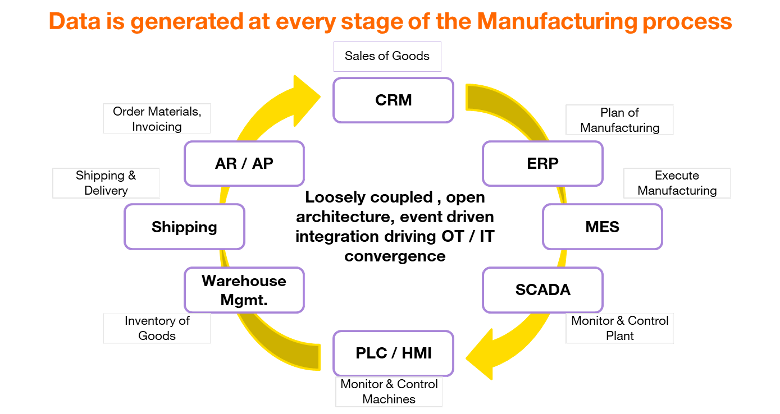

# Helping Manufacturers transform into a data driven organization

## Introduction (WHY)

The manufacturing sector is struggling in the journey towards Industry 4.0. Manufacturers need to set themselves up for the opportunity to use all data generated internally as well as externally and use that to make data-driven decisions in near-real-time. This document addresses an approach that manufacturers must adopt to be a data-driven organisation, a key cornerstone for driving their Industry 4.0 transformation. This will lead to improved operational efficiency, reduced downtime, enhanced product quality, and optimised maintenance processes, forming the foundation of a digitalized supply chain.

Operation Technology systems (OT), i.e. applications running specifically for the manufacturing site; are significantly different from Information Technology systems (IT). Even in many advanced companies, these OT systems are poorly connected, in many cases, point-to-point, making data extraction extremely difficult (polling) or many times non-existent (i.e. via paper).

The most complex problem to implement AI ( even in Manufacturing ) is good, contextualised data. The UNS solve this at scale by solving the data extraction problem.

### State of the Manufacturing Industry

The state of the manufacturing industry in terms of Industry 4.0 is one of uneven progress.

- **Adoption:** While Industry 4.0 has been around for a while now, adoption across the manufacturing industry has been uneven, across the same organisation too owing to legacy systems, factories, data illiteracy etc.
- **Benefits**: For those who have embraced Industry 4.0, the benefits are significant. These include increased efficiency, productivity, and safety on the factory floor.
- **Challenges:** Key challenges hindering wider adoption include high investment costs required for new technologies and infrastructure, cybersecurity risks associated with increased connectivity, and the need to address the skills gap in the workforce as jobs transform.
- **Key technologies:** The core technologies driving Industry 4.0 include the Industrial Internet of Things (IIoT), big data analytics, artificial intelligence (AI), robotics, and additive manufacturing (3D printing).

Our focus in this document will be on IIoT, Big Data Analytics and Artificial Intelligence. We are excluding robotics and 3D printing from the scope of this transformation.

### Desired Target

To make manufacturers truly data-driven, we need to ensure all generated data is systematically stored, combined, and historized, simplifying data acquisition for projects. Adopting AI/ML in manufacturing is complex, costly, and time-consuming, often leading to failure at scale. By making timestamped data in the manufacturing value chain easily accessible in a contextual hierarchy, we reduce data discovery costs. When done correctly this will result in

1. Reduce Data Acquisition for all Data Analytics projects by 80%
2. Cleansed, Contextual and Comprehensive data making AI/ML model training & validation faster and cheaper by 60%
3. Loosely coupled architecture, making the replacement of systems easier, simpler, faster and cheaper by simplifying the integration.
4. More secure integration pattern between IT and OT systems by reducing the need for inbound connections to relatively insecure OT systems
5. Fully Connected Digital Supply chain to support optimised production & asset inventory saving up to 50% warehouse costs
6. Reduce network load by 60% due to report by exception instead of data polling.

## Goals (WHAT)

The Key Characteristics of the UNS:

1. **Single Source of Truth:** UNS is the central repository of all data generated within the enterprise, ensuring consistency and reliability
2. **Real-Time Data Representation:** The Unified Namespace is a single pane of glass for all data and information in a business
3. **Scalability and Flexibility:** Loosely coupled & Event-based architecture of the UNS makes adding new and replacing legacy systems easier
4. **Foundation for Advanced Applications:** The centralised data structure of the UNS is essential for applications like predictive analytics and real-time optimisation.

To achieve this successfully in a manufacturing company we have defined 3 phases and appropriate goals

### Short Term goals (0 to 3 months)

- **Inventory of all OT** to determine the best way of integrating data extraction via publishing from them i.e. PLC (Programmable Logic Controller), MES (Manufacturing Execution System), SCADA (Supervisory Control and Data Acquisition), HMI (Human Machine Interface)
- **Inventory of all IT assets** relevant to the manufacturing value chain i.e. CRM (Customer Relationship Management), ERP (Enterprise Resource Planning), CMS (Component Management Systems), AR/AP (Account Receivables/Account Payables), WMS (Warehouse Management Systems)
- **Establish Cyber Security** and Data Access policies for the data extracted. Because of using a Pub-Sub mechanism, extracting data from OT systems will be more secure due to no inbound connections required to get data from the manufacturing site.
- **Publish guidelines** for the hierarchy and semantics of data to be published. Recommend following the ISA-Part 2 recommendation of

_&lt;enterprise&gt;_/_&lt;facility&gt;_/_&lt;area&gt;_/_&lt;line&gt;_/_&lt;device&gt;_

- **Create the First version of UNS** for one line of devices on one plant floor – Only PLCs on one line within a factory, publish all data to the UNS appropriately.
- **Calculate OEE** (OVERALL EQUIPMENT EFFECTIVENESS) from the data in the UNS and publish it back. Use OEE trending over time to investigate the cause of waste in the manufacturing process.

OEE = Availability \* Performance \* Quality.

### Medium Term goals (3 months to 9 months)

- **Expand UNS from** one line to progressively other lines, and other facilities. In parallel start enriching the UNS with IT systems (CRM, ERP etc) and support automated data discovery
- **Explore the feasibility and efficacy** of migrating historical data from existing OT systems
- **Connect ML models** to analyse the historical data in the UNS to identify patterns (Descriptive Analytics)
- **Predictive Maintenance** of OT systems to increase performance and reduce downtime by tracking all data points from the various OT systems. To predict failures and thereby enable floor technicians to take corrective action. (Predictive Analytics)
- **Quality Control and Defect Detection** by analysing production line data for spotting defects faster and more accurately

### Long Term goals (9 months to 36 months)

- **Build a comprehensive Unified Namespace (UNS)** to which all data generated in the organisation across IT and OT (raw, calculated, dashboards, trained ML models) are stored in a semantic hierarchy, combined and historized
- **Event-based Architecture** ensures loose coupling of OT & IT systems making replacement of any system simple, faster, and cheaper compared to point-to-point connections across OT & IT. Replace or retrofit systems to add messaging/pub-sub capabilities.
- **Real-time decisioning** to enable manufacturers to decide on key aspects like optimal stock, just-in-time manufacturing, optimal scheduling of jobs, etc. by combining OT & IT data (Predictive and Prescriptive Analytics)
- **Connect UNS** of current Organisation with suppliers to provide real-time insight on demand leading to just-in-time fulfilment, thereby reducing warehouse costs, and waiting costs. (Prescriptive Analytics)

## Approach (HOW)

The steps to becoming a data-driven manufacturer are:

1. **Connect** all your Systems to get Data
2. **Collect** Data in a contextually aware manner and a semantic hierarchy
3. **Store** Data by merging the same context as well as historizing all data
4. **Analyse** Data by easily acquiring and co-relating data across various OT/IT systems including their historical data
5. **Visualizing** the data e.g. just showing casing the OEE per line and aggregates across the facility over time will be a huge boost for many facilities.
6. **Find Patterns** both from a human eye on the visualisations as well as using ML models over the data.
7. **Report** findings and patterns; test hypothesis of the cause of patterns identified.
8. **Solve** manufacturing problems like predictive maintenance, digital supply chain etc, because data acquisition costs have significantly reduced.

## Key Principles

The Key principles for all components are

1. **Edge Driven:** The system producing the data publishes the data with the correct semantics and to the right hierarchy instead of data system polling for data (pub/sub) instead of data store polling data and then interpreting it.
2. **Report by Exception:** Publish only changed data instead of all data, (since OT systems generate a huge amount of data. e.g. A PLC can generate over 50k tags per minute but only 20% change across subsequent calls). Avoid Polling
3. **Lightweight:** Choose a lightweight integration platform which minimizes the overhead of collecting data from disparate systems and can scale easily to ingest the huge (Terabyte to Petabyte) volume of data.
4. **Open Architecture:** to ensure extracting data from third-party components is technically, contractually and legally feasible.

### Recommended timeline for the first pilot

the following is a high level recommendation for defining the first pilot. This will need to be adapted and modified based on the digital maturity of your organization.
It is highly recommend to first conduct a Digital Maturity Assessment first but in my experience, organizations tend to be averse and skeptical to such large and big scale maturity assessments

- **2 weeks** – Identify and agree on which factory line to pilot
- **6 weeks** - Inventory all OT & IT assets
- **4 months** – Integrate edge of node systems to legacy OT systems and directly IIoT-enabled devices and demonstrate the calculation of OEE as well as dashboarding OEE trend across the
- Implement insights from the analytics to realise benefits (post-pilot)

### Scaling after the pilot

Once the pilot has been successful, the code used to integrate other instances of the same legacy devices can be easily installed and adapted to ensure data extraction from those devices is rapidly achieved.

The exact plan and road map for expanding the scope to other lines, factories and even IT systems will need to be defined and refined in an agile manner based on the learnings of the pilot.

### Fully Connected Supply Chain

As meaningful data, analytics and insights are generated and stored back into the UNS, discussion with our supply chain should be initiated to ensure they start with optimising and digitising their process and can serve us better with appropriate contextual and real-time inputs from us.

Ideally, they also benefit from creating a similar UNS which can subscribe to and publish into; leading to a fully integrated digital supply chain.

### Key Risks and Mitigations

| Sno | Risk (Description, Impact, Probability)                                                                                                               | Mitigation                                                                                                                                                                                                                                         |
| --- | ----------------------------------------------------------------------------------------------------------------------------------------------------- | -------------------------------------------------------------------------------------------------------------------------------------------------------------------------------------------------------------------------------------------------- |
| 1.  | Cultural resistance due to change towards becoming more data-driven  Impact: High / Probability: High                                         | Executive Support  Educational support  Showcases quick wins easing the pain on the shop floor                                                                                                                                     |
| 2   | Technical Limitations: non-compliance of current OT/IT inventory [to Key principles of UNS](#key-principles)  Impact: Low / Probability: High | Implement tactical Edge of Node Devices to translate legacy protocols to event-based.  Planned obsolesce of legacy systems                                                                                                                 |
| 3.  | Technical Limitation: Large Payloads of more than 256MB are not supported by MQTT  Impact: High / Probability: Low                            | For the majority of IIOT systems with reporting by exception, this limit will not be reached. For IT Systems or high-res video systems implement tactical Edge of Node which can break the payloads into smaller chunks to be re-aggregated later. |
| 4.  | Technical Limitation: High fidelity data generation or ultra-low latency required for OT system  Impact: Medium / Probability: High           | Evaluate options like SparkPlugB or Edge of Node to package multiple payloads in one master to ensure data fidelity is maintained  Support point to point polling integrations just at the OT systems for ultra-low latency scenarios      |
| 5.  | Lack of support / complexity using FOSS solutions vs. expensive COTS solutions  Impact: Low / Probability: High                               | Start with FOSS and develop inhouse capability showcasing Value. Migrate to COTS when the value is justified                                                                                                                                       |

## Key Stakeholders (WHO)

As this is an extremely disruptive and far-reaching transformation, it is important to balance multiple stakeholders from an involvement to being informed/educated perspective.

The key stakeholders to consider are

1. **Core Crossfunctional UNS team:** responsible for assessing and implementing the UNS incrementally across manufacturing units and IT systems. The initial skills required are across full stack developers, Data Architects, DevOps, PLC/HMI programmers etc. The team skills will be adapted based on the inventory assessment and the rollout plan e.g. CRM, ERP developers etc.
2. **Executive Leadership:** Key stakeholders whose buy-in and commitment are critical to unblock resistance from middle management.
3. **CIO/CTO:** Key partner to help provide technical personnel needed to inventory assets, assess Key principles and execute the implementation of the UNS in an agile manner
4. **CISO / Cyber Security / Data Protection:** Assess and sign needed for the assessment of OT/IT convergence and revised threat model
5. **Plant Manager:** Primary beneficiary from the better data and corresponding visualisations. Will need education and coaching to change towards data-driven decision making.
6. **Machine Operators:** Important SMEs with key institutionalised knowledge about the manufacturing systems and can be invaluable allies. Have to ensure that their fear of job security and relative technophobia is appropriately addressed.

## Appendix

### Manufacturing Value Chain

Manufacturing generates data at every stage, yet this data is not accessible or mostly ignored. For effective usage of AI & ML and Data Analytics, we have to establish a mechanism for extracting and correlating this data and reducing data acquisition costs.

 
_Figure 1: High-level view of systems generating data in the manufacturing value chain_

### Understanding ISA Part 2 and its application to the UNS

The [ISA 95 standard](https://www.isa.org/intech-home/2017/november-december/features/isa-95-to-support-smart-manufacturing-iiot) is quite comprehensive and detailed. We choose to leverage a part of this specification which is the semantic hierarchy. This provides guidance for the appropriate level to publish the data too.

This is a critical aspect because the hierarchy provides some key benefits

The overall structure provides an easy mechanism for self-discovery, simplified data acquisition as well as ability to incrementally populate the UNS

Having the enterprise as the root node also allows the possibility for organisations to share relevant data with their customers and suppliers leading to the fully digital supply chain.

The level at which the message is published has a direct implication on its time sensitivity as well as guidance on being processed at the edge or on the cloud.

 
_Figure 2: The hierarchical structure proposed by ISA 95 -Part 2_

### Unified Name Space (UNS)

A Unified Namespace(UNS) is an **_architecture_** that establishes a **_centralized repository_** of data, events, information, and context **_across all IT and OT systems_** where any application or device can consume or publish data needed for a specific action via an **_event-driven_** and **_loosely coupled architecture along_** with the **_relevant context and history._**

This is a critical concept to allow scalability by preventing point-to-point connectivity.

 
_Figure 3: Unified Name Space_

### Connecting Unified Name Space (UNS) across organisations to create the digital supply chain

As the information, events and insights of each enterprise are published into its own UNS, the event-driven architecture of this concept allows easy integration of multiple enterprises across the supply chain while restricting access to only the required data ( governed by Access Control Lists).

 
_Figure 4: [LinkedIn Post](https://www.linkedin.com/posts/walkerdreynolds_unifiednamespace-iiot-digitaltransformation-activity-7212069188264157184-Rfrd) from Walker Reynolds_

### Types of Manufacturing

1. [Repetitive Manufacturing](https://katanamrp.com/blog/types-of-manufacturing-processes/#repetitive): Repeated production that commits to a production rate. Repetitive processing is comprised of dedicated production lines that produce the same or paraphernalia of items, 24/7, all year round.
2. [Discrete Manufacturing](https://katanamrp.com/blog/types-of-manufacturing-processes/#discrete): It also utilizes an assembly or production line. However, this process is extremely diverse, with a variety of setups and changeover frequencies. This is due to factors based on whether the products in production are similar or discordant in design.
3. [Job Shop Manufacturing](https://katanamrp.com/blog/types-of-manufacturing-processes/#jobshop) makes use of production areas rather than assembly lines. This is because this process will produce smaller batches of custom products, which can be either made-to-order (MTO) or made-to-stock (MTS).
4. [Process Manufacturing (Continuous)](https://katanamrp.com/blog/types-of-manufacturing-processes/#processcontinuous) Similar to repetitive manufacturing it too also runs 24/7. However, the difference is that this manufacturing process produces raw materials that are gases, liquids, powders, or slurries. But, in areas like mining, the products can be granule materials.
5. [Process Manufacturing (Batch)](https://katanamrp.com/blog/types-of-manufacturing-processes/#processbatch) shares similarities with discrete and job shop processes. Depending on consumer demand, one batch could be enough to meet that demand. Once a batch is completed, the equipment is cleaned, and ready to produce the next batch when needed. Batch processes are continuous in nature.

## References

- [OEE - How to Calculate](https://www.oee.com/calculating-oee/)
- [Video explaining UNS](https://youtu.be/PB_9HIgSCWc)
- [UNS Q&A by Walter Reynolds](https://youtu.be/IiUZTSGjCQI)
- [Event-driven architecture on Wikipedia](https://en.wikipedia.org/wiki/Event-driven_architecture)​
- [Advantages of Event-Driven Architecture](https://developer.ibm.com/articles/advantages-of-an-event-driven-architecture/)
- [ISA 95 Overview](https://www.leanvalidation.eu/index.php/isa-standards/isa-95)
- [ISA 95 standard](https://www.isa.org/intech-home/2017/november-december/features/isa-95-to-support-smart-manufacturing-iiot)
