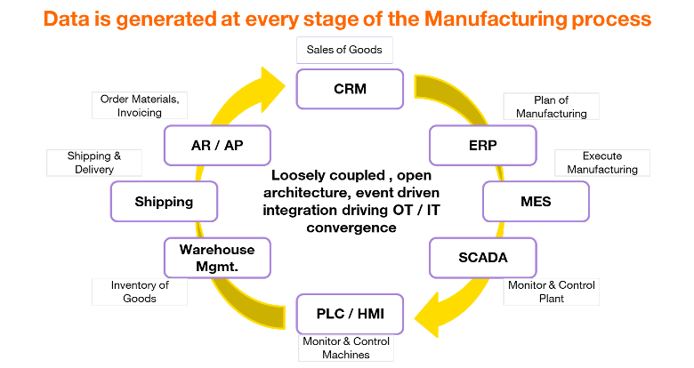

# Lead the Industry 4.0 revolution with clarity, not complexity.

Manufacturers face a critical gap: 85% of industrial data remains siloed or unused, costing billions in inefficiency and missed opportunities. Legacy systems, fragmented integrations, and reactive decision-making are no longer sustainable.

## UNS redefines operational excellence.

Our Unified Namespace architecture seamlessly converges OT and IT data into a single, contextualized source of truth, empowering real-time decision-making and AI scalability.

## Strategic outcomes for your enterprise:

- 80% faster data acquisition for analytics and AI, accelerating ROI.

- Predictive maintenance to reduce downtime by up to 30%, safeguarding productivity.

- A digital-first supply chain that cuts inventory costs by 50% through real-time demand insights.

## Phased implementation, immediate value:

Within 4 months, pilot a production line with full OEE transparency. Scale enterprise-wide in 12–18 months, future-proofing operations with an event-driven, loosely coupled architecture.
This is not just a technical upgrade—it’s a **strategic imperative** to outpace competitors, mitigate cybersecurity risks, and empower your workforce with actionable intelligence.

## Manufacturing Value Chain

Manufacturing generates data at every stage, yet this data is not accessible or mostly ignored. For effective usage of AI & ML and Data Analytics, we have to establish a mechanism for extracting and correlating this data and reducing data acquisition costs.

 
_Figure 1: High-level view of systems generating data in the manufacturing value chain_

## Transform data from a liability to your most valuable asset.

_Leadership starts with foresight_. Let’s build a foundation for sustained innovation
